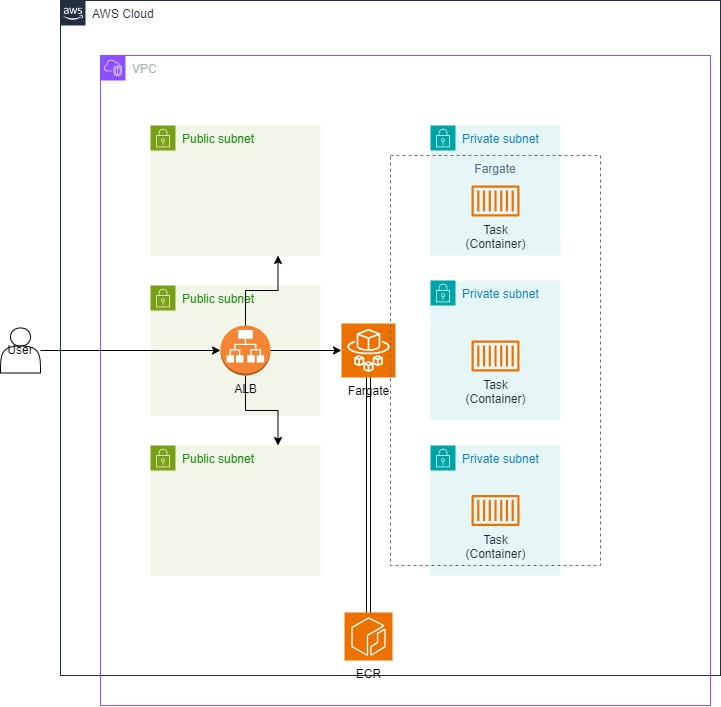

# canoe-devops-challenge

Terraform is used to build the required resources. It creates the whole infrastructure from network to ECS service.
The Makefile creates everything in the right order to prevent errors and warnings. Once the ECR repository is configured, the docker will build, tag and push the image to ECR. With the image pushed to ECR, the ECS cluster can use it to spin up the new task inside the service using the ECR image. An ALB is created to expose the private service to the outside.

NOTE 1: I didn't added the HTTPS listener, as it would require an ACM, but the HTTP listener is set to redirect to HTTPS;
NOTE 2: Due to the fact that the only listener is set to redirect, the apply fails because the service didn't find the loadbalancer associated with the target group;
NOTE 3: For the sake of completing this, I set the backend to be local, but I added a commented backend of type s3 to showcase how would I do it. 

## Requirements
- Make = 4.2.1 or higher
- Terraform = v1.9.0
- Docker = 20.10.21 or higher
- Python3 = 3.9 or higher
- AWS cli = 2.13.3 or higher

## Setup
Using make, run the following command to get everything up:
```
make
``` 

To tear down everything:
```
make terraform_destroy_all
```

## Application

Simple python and flask application, with the 3 endpoints requested.

### How to build

Run the followung command to build the image:
```
make build_docker
```

### How to run locally
Run the following command to run locally:
```
make docker_run
```

### Tag and push to ECR
Run the following command to run locally:
```
make docker_push
```

## Terraform
The terrform code will create the following architecture:


- 3 private subnets, and 3 public subnets, with 3 natgateways, one per private subnet;
- ECS cluster, service and tasks definitions;
- Load Balance on public subnets to receive traffic;
- Service and tasks will be deployed on private subnets, running on Fargate;
- ECR images used as source for the service deployments;
- ECS service output to Cloudwatch;

### Terraform-docs

#### Requirements

| Name | Version |
|------|---------|
| <a name="requirement_aws"></a> [aws](#requirement\_aws) | ~> 5.0 |

#### Providers

| Name | Version |
|------|---------|
| <a name="provider_aws"></a> [aws](#provider\_aws) | 5.69.0 |

#### Modules

| Name | Source | Version |
|------|--------|---------|
| <a name="module_ecs"></a> [ecs](#module\_ecs) | terraform-aws-modules/ecs/aws | n/a |
| <a name="module_vpc"></a> [vpc](#module\_vpc) | terraform-aws-modules/vpc/aws | n/a |

#### Resources

| Name | Type |
|------|------|
| [aws_alb.this](https://registry.terraform.io/providers/hashicorp/aws/latest/docs/resources/alb) | resource |
| [aws_dynamodb_table.terraform_state_lock](https://registry.terraform.io/providers/hashicorp/aws/latest/docs/resources/dynamodb_table) | resource |
| [aws_ecr_repository.this](https://registry.terraform.io/providers/hashicorp/aws/latest/docs/resources/ecr_repository) | resource |
| [aws_lb_listener.http](https://registry.terraform.io/providers/hashicorp/aws/latest/docs/resources/lb_listener) | resource |
| [aws_lb_target_group.target_group](https://registry.terraform.io/providers/hashicorp/aws/latest/docs/resources/lb_target_group) | resource |
| [aws_s3_bucket.terraform_state](https://registry.terraform.io/providers/hashicorp/aws/latest/docs/resources/s3_bucket) | resource |
| [aws_s3_bucket_versioning.terraform_state](https://registry.terraform.io/providers/hashicorp/aws/latest/docs/resources/s3_bucket_versioning) | resource |
| [aws_security_group.alb](https://registry.terraform.io/providers/hashicorp/aws/latest/docs/resources/security_group) | resource |
| [aws_availability_zones.available](https://registry.terraform.io/providers/hashicorp/aws/latest/docs/data-sources/availability_zones) | data source |
| [aws_caller_identity.current](https://registry.terraform.io/providers/hashicorp/aws/latest/docs/data-sources/caller_identity) | data source |
| [aws_region.current](https://registry.terraform.io/providers/hashicorp/aws/latest/docs/data-sources/region) | data source |

#### Inputs

| Name | Description | Type | Default | Required |
|------|-------------|------|---------|:--------:|
| <a name="input_app_port"></a> [app\_port](#input\_app\_port) | n/a | `number` | `5000` | no |
| <a name="input_environment"></a> [environment](#input\_environment) | n/a | `string` | `"dev"` | no |
| <a name="input_project_name"></a> [project\_name](#input\_project\_name) | n/a | `string` | `"gamma"` | no |

#### Outputs

| Name | Description |
|------|-------------|
| <a name="output_ecr_repo"></a> [ecr\_repo](#output\_ecr\_repo) | n/a |
| <a name="output_get_object_url"></a> [get\_object\_url](#output\_get\_object\_url) | n/a |
| <a name="output_health_url"></a> [health\_url](#output\_health\_url) | n/a |